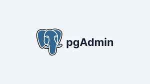

# PRACTICA DE CONTENEDORES WEB 
## 1. Titulo
Elaboración de dos contenedores diferentes de Postgres y PgAdmin con Docker Compose
## 2. Tiempo de duración
Para esta practica tarde 35 minutos
## 3. Fundamentos:

Postgres: es un sistema de gestión de bases de datos relacional de código abierto que proporciona herramientas avanzadas para el manejo de datos, con soporte a consultas complejas, transacciones y funciones avanzadas.

Figura 1: Postgres

PgAdmin: es una herramienta de administración y desarrollo para PostgreSQL que ofrece una interfaz gráfica para gestionar bases de datos, ejecutar consultas SQL y administrar usuarios y permisos.

Figura 2: Pgadmin

Docker: es una plataforma que permite la creación y ejecución de aplicaciones en contenedores. Un contenedor es una instancia ligera y portátil que incluye todo lo necesario para que una aplicación funcione, como el código, las librerías y las configuraciones

Figura 3: Docker

## 4. Conocimientos previos.
Para esta practica es importantes el conocimeinto de los siguientes temas:
   
- Comandos lux: Interaccion con la terminal, comando de navegacion y usos de permisos 
- Manejo de navegador: Conceptos con imagenes,contenedores y redes
- Manejo de Docker: Conceptos de contenedores, redes y volúmenes.
- Manejo de navegador web: Para verificar su funcionamiento.

## 5. Objetivos a alcanzar
   
- Implementar contenedores para bases de datos y herramientas de administración de bases de datos.
- Configurar archivos YML para gestionar los servicios.
- Verificar el funcionamiento de la conexión entre los contenedores de Postgres y PgAdmin.
## 6. Equipo necesario:
  
- Computador con sistema operativo Windows/Linux/Mac.
- Docker Desktop instalado y configurado.
- Visual Studio Code 

## 7. Material de apoyo.
   
- Documentacion de docker.
- Guia de asignatura.
- Cheat sheet sobre los comandos de linux

  
## 8. Procedimiento

Paso 1: Creamos un archivo llamado docker-compose.yml en Visual Studio Code, en el cual definimos los servicios de Postgres y PgAdmin.

Figura 4: Archivo compose.

Paso 2: Abrimos la terminal en la ubicación del archivo docker-compose.yml y ejecutamos el siguiente comando para iniciar los contenedores, pero tiene que estar abierta la aplicacion de docker desktop.

Figura 5: Docker.

Paso 3: Por ultimo en el navegador abrimos el localhost:5050 ya definido y colocamos el usuario y la contraseña antes puesta y asi entramos a pgadmin y podemos crear tablas.

Figura 6: Pgadmin

## 9. Resultados esperados:
    
Al finalizar la práctica, ambos contenedores deben estar en ejecución, y desde PgAdmin deberíamos poder conectarnos a la base de datos en el contenedor de Postgres.

## 10. Bibliografía
    
- Docker: Accelerated Container Application Development. (2024, 8 julio). Docker. https://www.docker.com/
- PostgreSQL: Documentation. https://www.postgresql.org/docs/
- PgAdmin. (s. f.). https://www.pgadmin.org/